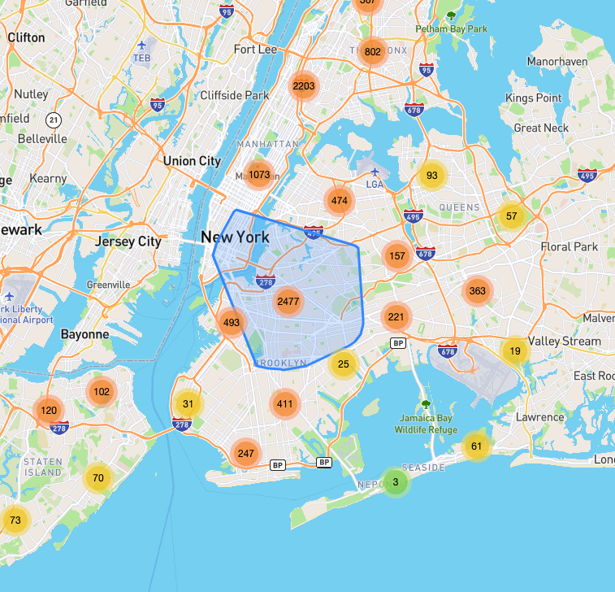
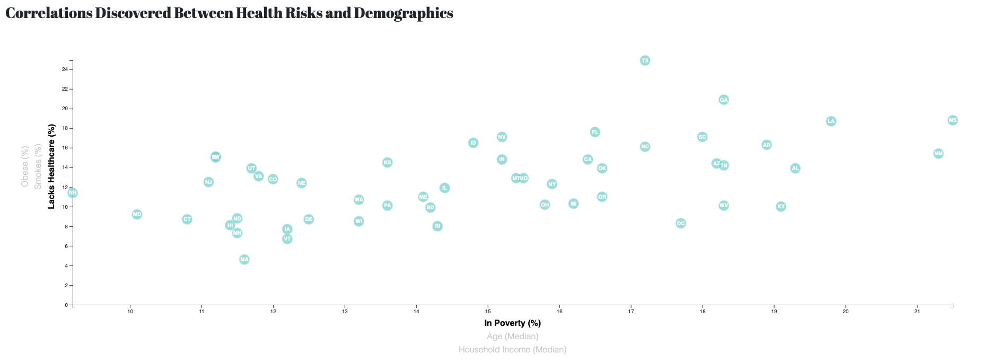
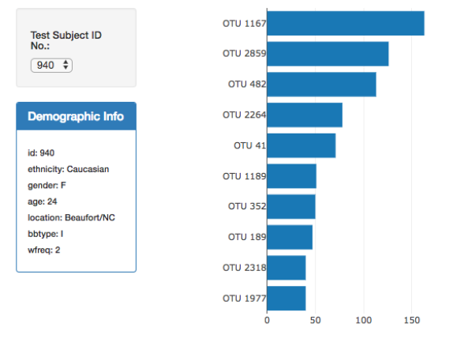
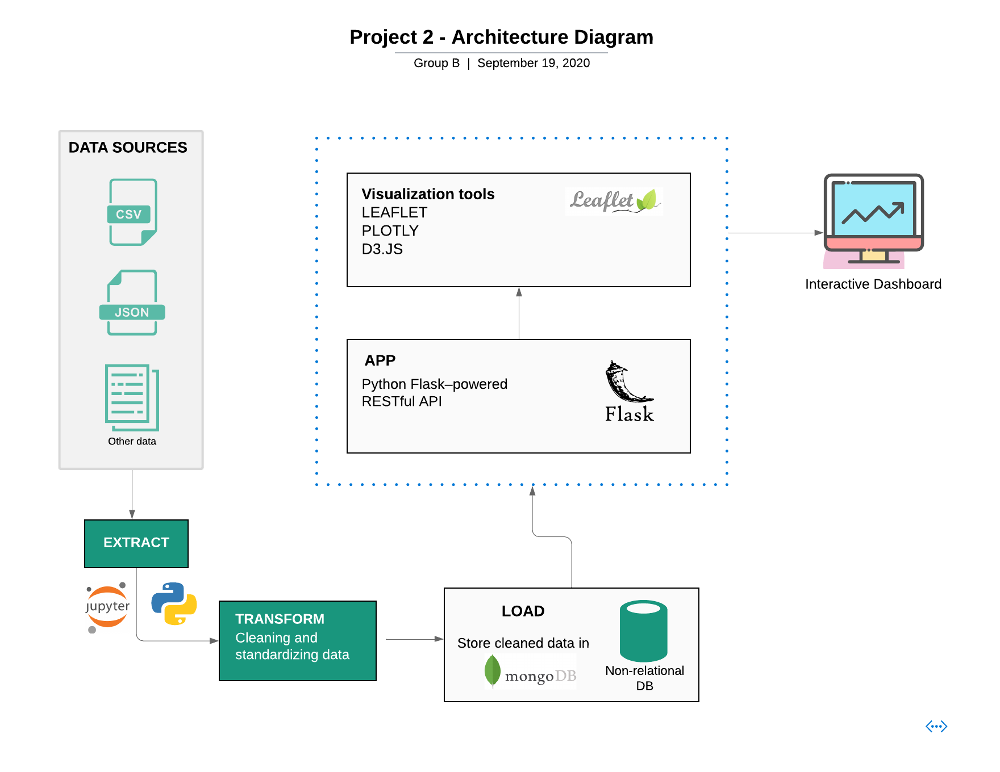

# Project-2 Proposal

## Team 👨🏻‍💻👨🏻‍💻👨🏻‍💻👩🏻‍💻👩🏻‍💻

- [Jaehong Kwon](https://github.com/sssaso)
- [XiongFei (Frank) Shi](https://github.com/xshi64)
- [Feng Wang](https://github.com/FengWang1991)
- [Olive Sun](https://github.com/olivesun1213)
- [Neha Nayeem](https://github.com/neha-nayeem)

## Topic and Rationale 🌃🔪🩸📝
#### Topic: Toronto Crime and Demographics

* As residents of Toronto, we want to gain insights on Toronto safety and crime rates in different neighborhoods.
* After completion of project 1, we are equipped with more skills that will allow us to further analyze and visualize different type of charts interactively.

## Datasets 🗃
* [Toronto Police Open Data](https://data.torontopolice.on.ca/pages/open-data)
* [Toronto Open Data - Neighbourhood Profiles](https://open.toronto.ca/dataset/neighbourhood-profiles/)
* [Toronto Neighbourhoods Ward Model](https://www.toronto.ca/city-government/data-research-maps/neighbourhoods-communities/ward-profiles/47-ward-model/)

## Viz Inspiration📊 📈 📉

## Architecture Diagram🖊

### ETL Process
* **Extract**: Toronto neighbourhood profiles and crime data were extracted from [Toronto Police Open Data](https://data.torontopolice.on.ca/pages/open-data) and [Toronto Open Data - Neighbourhood Profiles](https://open.toronto.ca/dataset/neighbourhood-profiles/) using their API.

* **Transform**: Using Jupyter Notebook and pandas, we cleaned and reorganized the data according to our needs.

* **Load**: Looking at the unpredictable structure of our data from our sources, Mongodb was our database of choice.

### Flask
Our Flask app connects to the mongo database and pulls in data, implements further transformation and hosts our API endpoints as follows:

* `/`: The root endpoint directs the user to the `index.html` page which holds the visualization dashboard.

* `/api/v1/raw-data`: This endpoint pulls data as is from the mongo database and returns a JSON format that is used by our code `logic-map.js` to create an interactive map.

* `api/v1/neighbourhood-summary`: This endpoint pulls another collection from the mongo database that holds neighbourhood demographics, used for plotting. Before the data is returned in JSON format, some additional transformation is completed to get the data in exactly the way we need it for plotting.

### Visualization
Our visualization dashboard consists of the following technologies:
* HTML/CSS
* Bootstrap
* D3.js
* Plotly.js
* Leaflet.js 

A map of Toronto is created using Leaflet.js/Mapbox, and data from our Flask API endpoint is used to create a marker cluster layer of crime incidents in the city. A [Toronto neighbourhoods GeoJson](https://github.com/jasonicarter/toronto-geojson) was used to create an additional GeoJson layer to emphasize neighbourhood boundaries.

A toggle bar on the top right also allows the user to turn off neighbourhood boundaries or crime markers, or choose a light map vs. an outdoors map.

Clicking on a crime marker will display a tooltip with details.

Event listeners and Bootstrap aid in an interactive environment where users can click on a neighbourhood and see a Bootstrap modal that displays that particular neighbourhood's plot of top crimes and demographics.

We also used D3.js to generate a **Crime vs. Demographics** scatter plot that uses D3 transitions and other elements to dynamically display the plot according to the values chosen by the user.

## Sources 🔗
* [Toronto Neighbourhoods GeoJson](https://github.com/jasonicarter/toronto-geojson)
