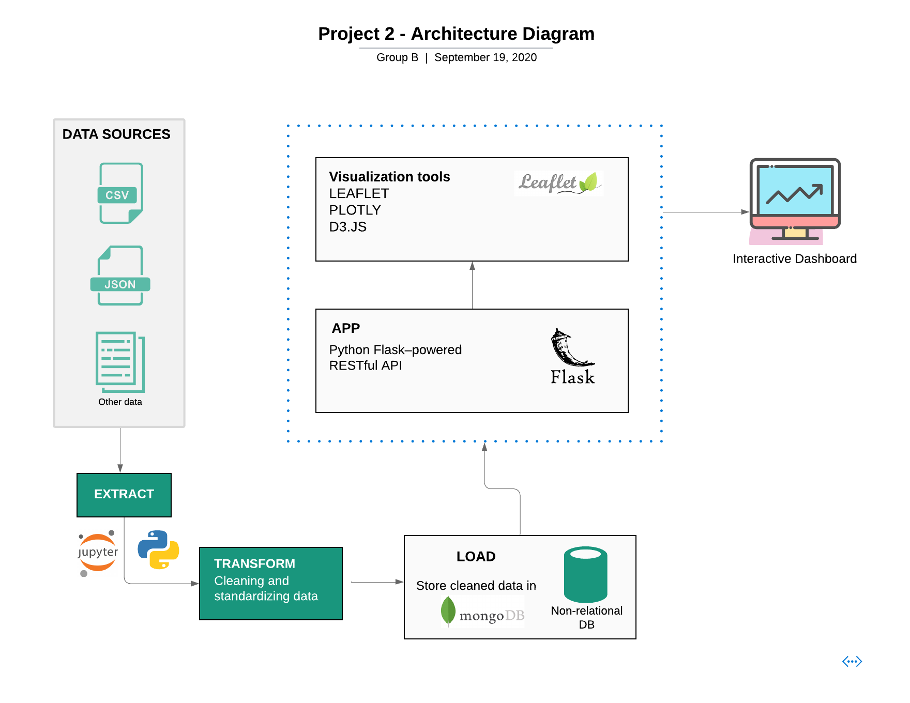

# Project-2 Proposal

## Team 👨🏻‍💻👨🏻‍💻👨🏻‍💻👩🏻‍💻👩🏻‍💻

- [Jaehong Kwon](https://github.com/sssaso)
- [XiongFei (Frank) Shi](https://github.com/xshi64)
- [Feng Wang](https://github.com/FengWang1991)
- [Olive Sun](https://github.com/olivesun1213)
- [Neha Nayeem](https://github.com/neha-nayeem)

## Topic and Rationale 🌃🔪🩸📝
* As residents of Toronto, we want to gain insights on Toronto safety and crime rates in different neighborhoods.
* After completion of project 1, we are equipped with more skills that will allow us to further analyze and visualize different type of charts interactively.

## Datasets 🗃
* [Toronto Police Open Data](https://data.torontopolice.on.ca/pages/open-data)
* [Toronto Open Data - Neighbourhood Profiles](https://open.toronto.ca/dataset/neighbourhood-profiles/)
* [Toronto Neighbourhoods Ward Model](https://www.toronto.ca/city-government/data-research-maps/neighbourhoods-communities/ward-profiles/47-ward-model/)

## Viz Inspiration📊 📈 📉

## Data Flow Diagram🖊

## Sources 🔗
* [Toronto Neighbourhoods GeoJson](https://github.com/jasonicarter/toronto-geojson)
